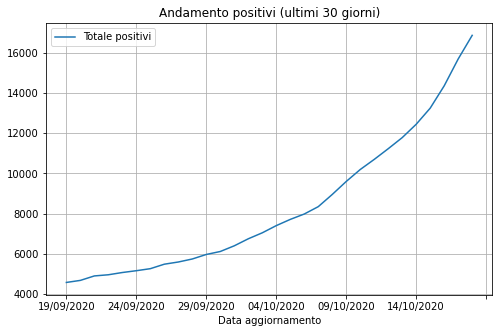
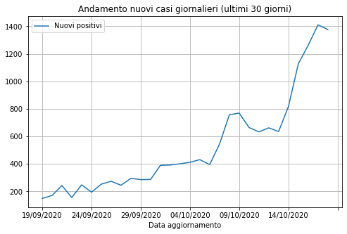
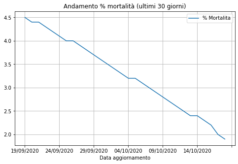
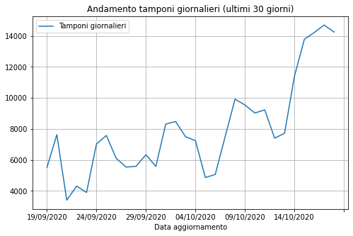
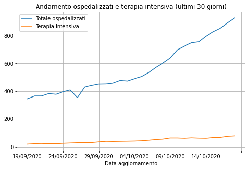

# analisi-dati-covid19-campania
Analisi su open data forniti dal catalogo degli open data della regione Campania.

[Link dataset - COVID-19 Monitoraggio situazione: Dati di dettaglio relativi alla Regione Campania](https://dati.regione.campania.it/catalogo/datasetdetail/covid-19-monitoraggio-situazione-dati-di-dettaglio-relativi-alla-regione-campania)


```python
# Caricamento dati da notebook di elaborazione
%run 1_elab_data_covid19_campania.ipynb
ultimi30giorni = dati_selezionati.tail(30)
attuale = dati_selezionati.tail(1)
```

#### Dati aggionati al: 18/10/2020

## Dati ultimi 30 giorni

### [1] Andamento positivi (totale)


```python
ultimi30giorni.plot(kind='line', x='Data aggiornamento', y=["Totale positivi"], grid=True, title='Andamento positivi (ultimi 30 giorni)', figsize=(8,5))
```


    <matplotlib.axes._subplots.AxesSubplot at 0x7ff1b0f95c70>





**Dato attuale**:


```python
attuale.loc[:,['Totale positivi']]
```


<div>
<table border="1">
  <thead>
    <tr style="text-align: right;">
      <th></th>
      <th>Totale positivi</th>
    </tr>
  </thead>
  <tbody>
    <tr>
      <th>237</th>
      <td>16865</td>
    </tr>
  </tbody>
</table>
</div>


### [2] Andamento nuovi casi giornalieri


```python
ultimi30giorni.plot(kind='line', x='Data aggiornamento', y=["Nuovi positivi"], grid=True, title='Andamento nuovi casi giornalieri (ultimi 30 giorni)', figsize=(8,5))
```


    <matplotlib.axes._subplots.AxesSubplot at 0x7ff1b029d610>





### [3] Andamento rapporto(%) Positivi/Tamponi


```python
ultimi30giorni.plot(kind='line', x='Data aggiornamento', y="% Positivi/Tamponi", grid=True, title='Andamento rapporto(%) Positivi/Tamponi (ultimi 30 giorni)', figsize=(8,5))
```


    <matplotlib.axes._subplots.AxesSubplot at 0x7ff1b0292e50>





**Dato attuale**:


```python
attuale.loc[:,['% Positivi/Tamponi']]
```


<div>
<table border="1">
  <thead>
    <tr style="text-align: right;">
      <th></th>
      <th>% Positivi/Tamponi</th>
    </tr>
  </thead>
  <tbody>
    <tr>
      <th>237</th>
      <td>9.7</td>
    </tr>
  </tbody>
</table>
</div>


### [4] Andamento tamponi giornalieri


```python
ultimi30giorni.plot(kind='line', x='Data aggiornamento', y=["Tamponi giornalieri"], grid=True, title='Andamento tamponi giornalieri (ultimi 30 giorni)', figsize=(8,5))
```


    <matplotlib.axes._subplots.AxesSubplot at 0x7ff1b0208640>





### [5] Andamento ospedalizzati e terapia intensiva


```python
ultimi30giorni.plot(kind='line', x='Data aggiornamento', y=["Totale ospedalizzati", "Terapia Intensiva"], grid=True, title='Andamento ospedalizzati e terapia intensiva (ultimi 30 giorni)', figsize=(8,5))
```


    <matplotlib.axes._subplots.AxesSubplot at 0x7ff1b01695b0>





**Dato attuale**:


```python
attuale.loc[:,['Totale ospedalizzati','Terapia Intensiva']]
```


<div>
<table border="1">
  <thead>
    <tr style="text-align: right;">
      <th></th>
      <th>Totale ospedalizzati</th>
      <th>Terapia Intensiva</th>
    </tr>
  </thead>
  <tbody>
    <tr>
      <th>237</th>
      <td>927</td>
      <td>78</td>
    </tr>
  </tbody>
</table>
</div>


### [6] Andamento tasso(%) mortalità


```python
ultimi30giorni.plot(kind='line', x='Data aggiornamento', y=["% Mortalita"], grid=True, title='Andamento % mortalità (ultimi 30 giorni)', figsize=(8,5))
```


    <matplotlib.axes._subplots.AxesSubplot at 0x7ff1b0145580>


**Dato attuale**:


```python
attuale.loc[:, ['% Mortalita']]
```


<div>
<table border="1">
  <thead>
    <tr style="text-align: right;">
      <th></th>
      <th>% Mortalita</th>
    </tr>
  </thead>
  <tbody>
    <tr>
      <th>237</th>
      <td>1.9</td>
    </tr>
  </tbody>
</table>
</div>


