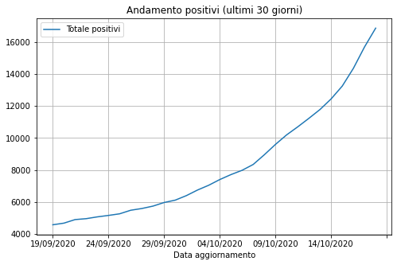
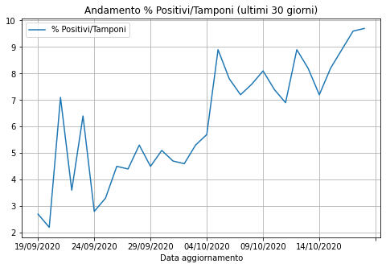
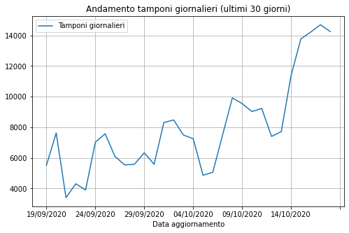

## Analisi dati inerenti a COVID19 in Campania da CSV prelevato da catalogo Open Data della regione Campania

[dataset - COVID-19 Monitoraggio situazione: Dati di dettaglio relativi alla Regione Campania](https://dati.regione.campania.it/catalogo/datasetdetail/covid-19-monitoraggio-situazione-dati-di-dettaglio-relativi-alla-regione-campania)


```python
# Caricamento dati da notebook di elaborazione
%run 1_elab_data_covid19_campania.ipynb
ultimi30giorni = dati_selezionati.tail(30)
```

### Andamento positivi (ultimi 30 giorni)


```python
ultimi30giorni.plot(kind='line', x='Data aggiornamento', y=["Totale positivi"], grid=True, title='Andamento positivi (ultimi 30 giorni)', figsize=(8,5))
```


    <matplotlib.axes._subplots.AxesSubplot at 0x7fee2242b190>





### Andamento nuovi casi giornalieri


```python
ultimi30giorni.plot(kind='line', x='Data aggiornamento', y=["Nuovi positivi"], grid=True, title='Andamento nuovi casi giornalieri (ultimi 30 giorni)', figsize=(8,5))
```


    <matplotlib.axes._subplots.AxesSubplot at 0x7fee1b72c250>


### Andamento % Positivi/Tamponi


```python
ultimi30giorni.plot(kind='line', x='Data aggiornamento', y="% Positivi/Tamponi", grid=True, title='Andamento % Positivi/Tamponi (ultimi 30 giorni)', figsize=(8,5))
```


    <matplotlib.axes._subplots.AxesSubplot at 0x7fee21d9ecd0>





### Andamento pazienti ospedalizzati e in terapia intensiva (ultimi 30 giorni)


```python
ultimi30giorni.plot(kind='line', x='Data aggiornamento', y=["Totale ospedalizzati", "Terapia Intensiva"], grid=True, title='Posti occupati in ospedale e terapia intensiva(ultimi 30 giorni)', figsize=(8,5))
```


    <matplotlib.axes._subplots.AxesSubplot at 0x7fee2008e760>


### Andamento tasso mortalità (ultimi 30 giorni)


```python
ultimi30giorni.plot(kind='line', x='Data aggiornamento', y=["% Mortalita"], grid=True, title='Andamento % mortalità (ultimi 30 giorni)', figsize=(8,5))
```


    <matplotlib.axes._subplots.AxesSubplot at 0x7fee1b750b50>


### Andamento tamponi giornalieri


```python
ultimi30giorni.plot(kind='line', x='Data aggiornamento', y=["Tamponi giornalieri"], grid=True, title='Andamento tamponi giornalieri (ultimi 30 giorni)', figsize=(8,5))
```


    <matplotlib.axes._subplots.AxesSubplot at 0x7fee1b5d0100>





```python

```
